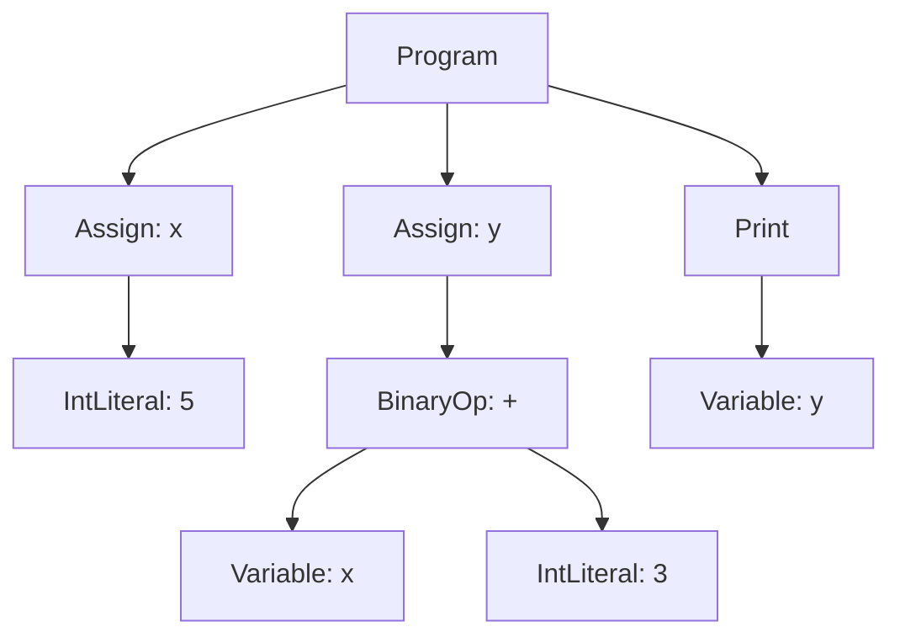

# Phase 1 AST Visualization

In Phase 1, the goal is to stop thinking of generated code as plain text.
Instead, generate a tree first.

Example MiniPython program:

```python
x = 5
y = x + 3
print(y)
```

The generated source code is the final output. The real structure should look
like this:

```text
Program
|
+-- Assign
|   |
|   +-- name: x
|   |
|   +-- value: IntLiteral
|       |
|       +-- value: 5
|
+-- Assign
|   |
|   +-- name: y
|   |
|   +-- value: BinaryOp
|       |
|       +-- op: +
|       |
|       +-- left: Variable
|       |   |
|       |   +-- name: x
|       |
|       +-- right: IntLiteral
|           |
|           +-- value: 3
|
+-- Print
    |
    +-- value: Variable
        |
        +-- name: y
```

Same idea as Python-like objects:

```python
Program([
    Assign(
        name="x",
        value=IntLiteral(5),
    ),
    Assign(
        name="y",
        value=BinaryOp(
            left=Variable("x"),
            op="+",
            right=IntLiteral(3),
        ),
    ),
    Print(
        value=Variable("y"),
    ),
])
```

The important Phase 1 pipeline:

```text
random choices
    |
    v
AST nodes
    |
    v
pretty-printer
    |
    v
Python source code
    |
    v
compile(...) check
```

## Expression Tree

For this expression:

```python
x + 3
```

The AST is:

```text
BinaryOp
|
+-- op: +
|
+-- left: Variable
|   |
|   +-- name: x
|
+-- right: IntLiteral
    |
    +-- value: 3
```

For a nested expression:

```python
(x + 3) * 2
```

The AST is:

```text
BinaryOp
|
+-- op: *
|
+-- left: BinaryOp
|   |
|   +-- op: +
|   |
|   +-- left: Variable
|   |   |
|   |   +-- name: x
|   |
|   +-- right: IntLiteral
|       |
|       +-- value: 3
|
+-- right: IntLiteral
    |
    +-- value: 2
```

## Mermaid Diagram

If your Markdown viewer supports Mermaid, this will render as a visual graph:



## How To Use This In Code

Do not generate this directly:

```python
"y = x + 3"
```

Generate this first:

```python
Assign(
    name="y",
    value=BinaryOp(
        left=Variable("x"),
        op="+",
        right=IntLiteral(3),
    ),
)
```

Then your pretty-printer turns that tree into:

```python
y = (x + 3)
```

That is the core Phase 1 idea.
